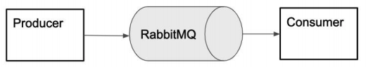
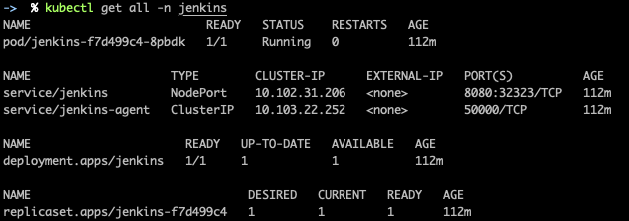
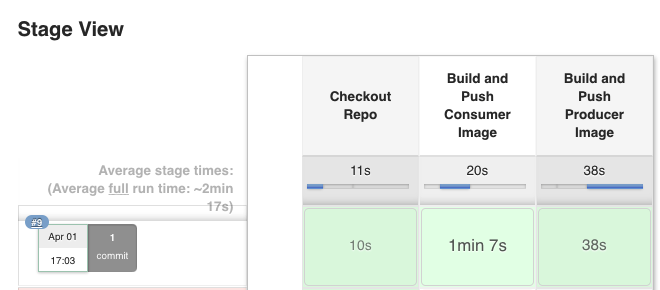
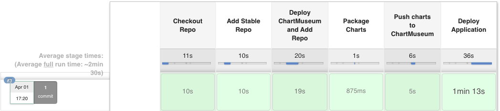
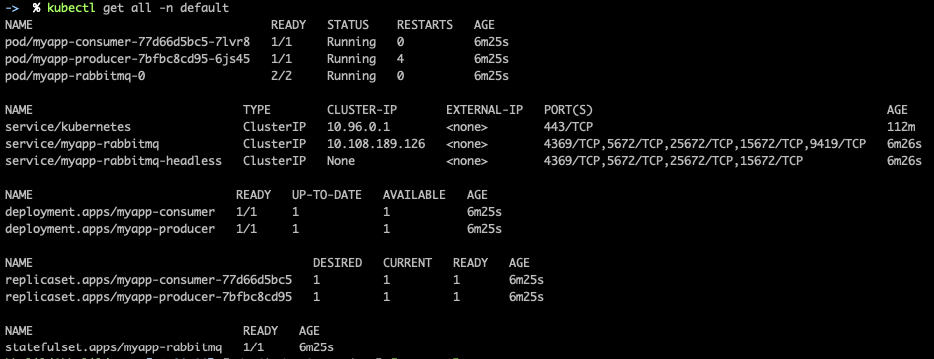
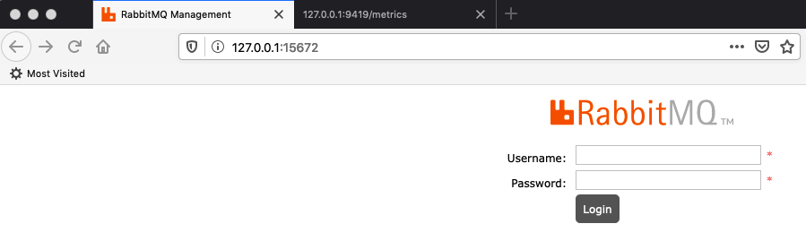
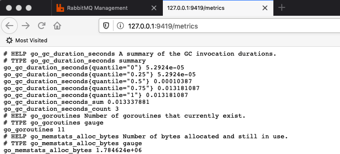

# Kubernetes Project

[Go To Solution](#project-solution)

In this paper we will describe the contents of the advanced DevOps course project.
The purpose is this project is to cover the following topics into one orchestrated pipeline of DevOps process.

The topics to be covered are:
1. Understand and use kubernetes various controllers and resources.
2. Develop and deploy helm charts for our applications.
3. Deploy and configure monitoring stack for the application.
4. We will implement an automatic CI / CD pipeline using Jenkins pipelines and Jenkins Kubernetes Plugin.

### Introduction
In this project our goal will be to build, push and deploy a full producer consumer solution on top of kubernetes. 
We will start with a given codebase of the applications, their Dockerfiles and docker-compose.yml files explaining how they are deployed and we will develop and implement those systems on kubernetes infrastructure.

### The Project
The project we will use in order to implement our DevOps needs is located at: https://github.com/avielb/rmqp-example.git

The project is composed from three parts:



The project infrastructure is based on a queueing mechanism implemented using RabbitMQ.

This is the meaning of each component in the system:
1. Producer - will send messages every X seconds to a queue found in rabbitmq server.
2. RabbitMQ - an application that is able to store data in a queue fashion allowing us to have the ability to maintain a queue of messages
3. Consumer - will listen to new messages on a queue in RabbitMQ server and will print them to STDOUT.

### Project’s Artifacts
1. Docker images for the consumer and producer applications.
2. Helm charts for deploying consumer and producer applications.
3. CI Pipeline - will use us to clone, build and push the application’s docker images.
4. CD Pipeline - will use us to build push and deploy the application’s helm charts.
5. RabbitMQ monitor - values.yaml file for configuring a deployment of RabbitMQ exporter helm chart deployment.

### Continuous Integration Pipeline
Within the project git repository we can see Dockerfiles provided for the Producer and the Consumer. 
Using those Dockerfiles + provided docker-compose.yml for the applications we are asked to develop a Jenkins pipeline that will do the following:
1. Clone the git repository
2. Build
    - docker image for producer
    - docker image for consumer
3. Push
    - docker image for producer
    - docker image for consumer
    
### Continuous Deployment Pipeline
Develop a jenkins pipeline that upon an execution the following steps will occur:
1. Checkout helm charts repository.
2. Define connectivity to our application’s kubernetes API server.
3. Run ‘helm upgrade’ to deploy the latest image of applications to the cluster.

### RabbitMQ Monitor
1. Deploy RabbiMQ to the cluster using the stable helm chart at: https://github.com/helm/charts/tree/master/stable/rabbitmq
2. Deploy RabbitMQ exporter in order to expose metrics regarding the status of our RabbitMQ server.

## Bonuses
1. Change the code of the producer to send infinite messages every 20 seconds
2. Change the code of the consumer to expose metric of about consumed messages **consumer_messages_count**(message_body) , metric will be exposed over http, under port 9422, in the endpoint “/metrics”
3. Create a PromQL statement to show the rate of messages consumed in 5m average granularity.
4. Use helm’s requirements.yaml file in order to add dependency in RabbitMQ helm chart
5. Deploy RabbitMQ with persistence enabled.
6. Use Rancher to deploy the kubernetes cluster and use Rancher Catalog to deploy the consumer and producer helm charts with RabbitMQ.

### What to send me?
● All of the project’s assets are made of various files that you will be creating, editing and changing in order to fulfill the project’s components on a kubernetes infrastructure.

● Those files should be added to a repository based named ‘k8s-project’ under your GitHub user.

● Upon receiving this project, you will have 3 weeks in total to complete it and send me a link to your git repository.

# Project Solution

### Pre-reqs
1. Minikube
2. kubectl
3. Helm

### How To:
1. Start Minikube and install Jenkins by running the script ```setup.sh```
    
    
2. Open Jenkins by browsing to http://localhost:8080
3. Login (User: admin Password: admin)
4. Add credentials to your Docker Hub account
    - Click **Credentials**
    - Click **global**
    - Click **Add Credentials**
    - **Kind**: Username with password
    - **Username**: your Docker Hub ID
    - **Password**: your Docker Hub password
    - **ID**: DockerHubCreds
    - Click **OK**
5. Create **CI** job:
    - Click **New Item**
    - Enter for item name: **CI**
    - Select **Pipeline**
    - Click **OK**
    - Scroll down to **Pipeline** section
        - **Definition**: Pipeline script from SCM
        - **SCM**: Git
        - **Repository URL**: https://github.com/khjomaa/DevOpsProject.git
        - **Script Path**: deployment/jenkins/ci-pipeline.groovy
    - Click **Save**
    - Click **Build Now**
    
        
6. Create **CD** job
    - Click **New Item**
    - Enter for item name: **CD**
    - Select **Pipeline**
    - Click **OK**
    - Scroll down to **Pipeline** section
        - **Definition**: Pipeline script from SCM
        - **SCM**: Git
        - **Repository URL**: https://github.com/khjomaa/DevOpsProject.git
        - **Script Path**: deployment/jenkins/cd-pipeline.groovy
    - Click **Save**
    - Click **Build Now**
    
        
        
        

NOTES:

To Access the RabbitMQ Management interface:
1. ```kubectl port-forward --namespace default svc/myapp-rabbitmq 15672:15672 &```
2. Browse to http://127.0.0.1:15672
3. User: **guest**, Password: **guest**




To access the RabbitMQ Prometheus metrics:
1. ```kubectl port-forward --namespace default myapp-rabbitmq-0 9419:9419 &```
2. Browse to http://127.0.0.1:9419/metrics

